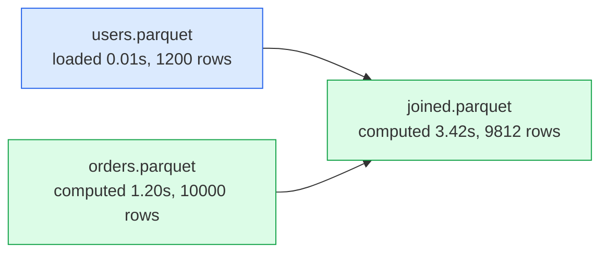
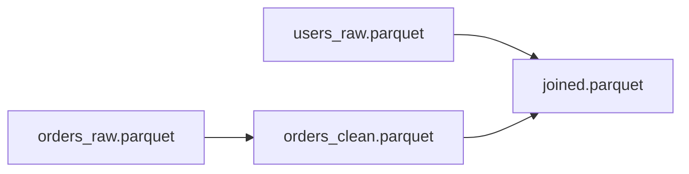
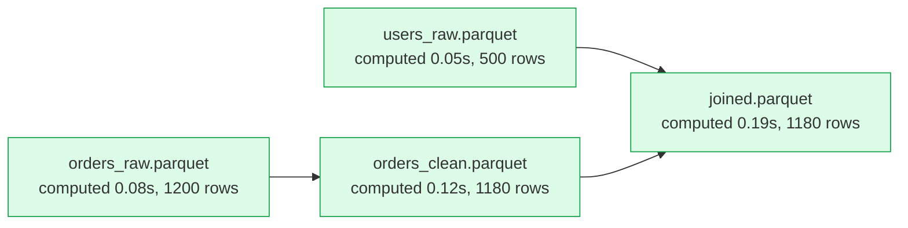
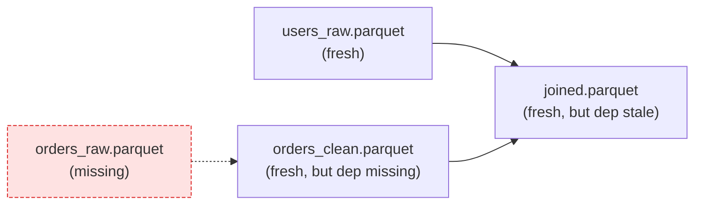
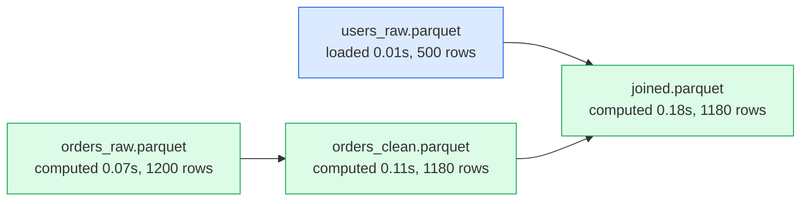
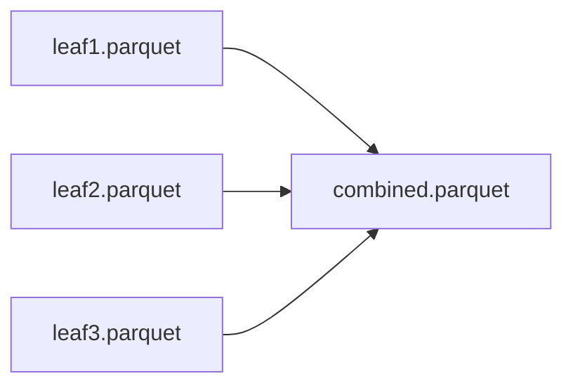
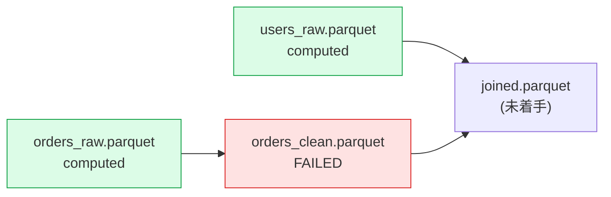
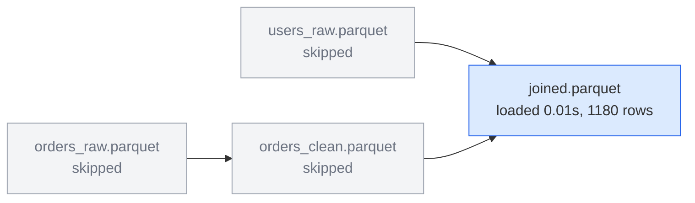
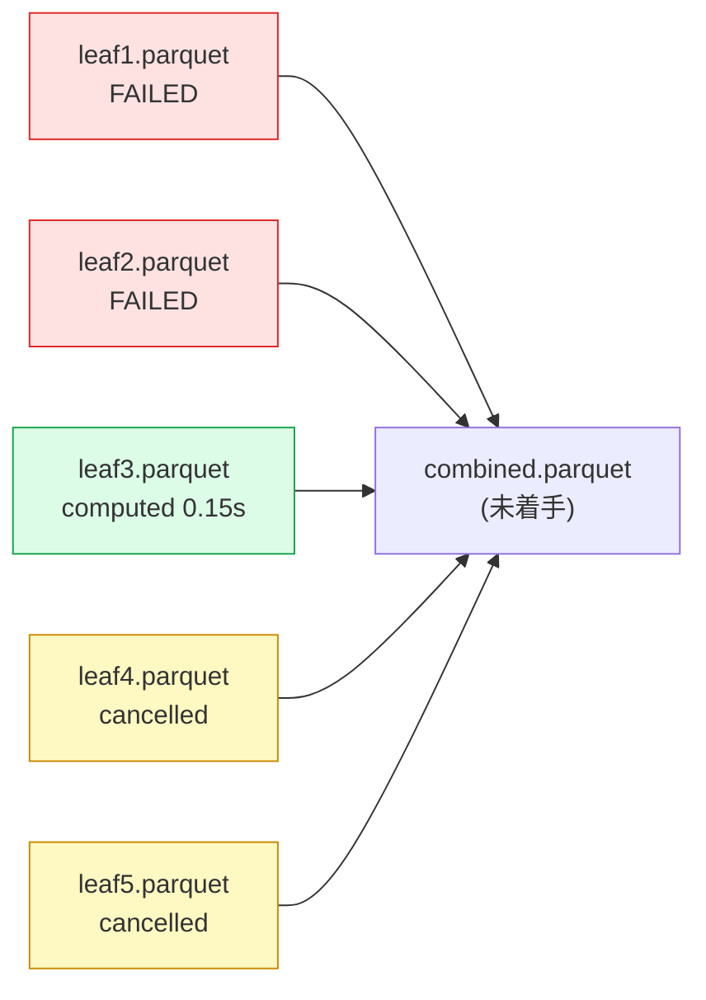

# 実装指示書: 構造化ログと実行可視化

## 0. 背景と目的

現行のログは stdlib `logging` の INFO 3 行(`computed / loaded / skipped`)のみで、次が観測できない:

- **run の相関**: 複数 run が混ざったログからどのイベントがどの実行のものか判別できない(並列 run・長時間バッチで致命的)。
- **判定理由**: あるノードがなぜ再計算されたのか(ファイル欠損 / force / 上流再計算 / mtime)がログから分からない。
- **実行結果**: 行数・カラム数・ファイルサイズ・所要時間が(duration 以外)残らない。
- **依存構造**: DAG の形・どの経路が再計算されたかを後から可視化できない。

本指示書は、(1) 構造化ログ基盤の導入、(2) イベント仕様の確定、(3) 実行結果と依存関係の可視化(Mermaid / Markdown レポート)を定める。**ログイベントを唯一の情報源(single source of truth)とし、可視化はイベントの消費者として実装する。`run()` の公開 API は変更しない**(§2.2 で `keep_intermediate` を却下したのと同じ判断: 戻り値・引数を肥大させない)。

## 1. ライブラリ選定

**structlog を採用**し、`pyproject.toml` の dependencies に `structlog>=24` を追加する。`flume_spec.md` §1 の「外部依存は polars のみ」は「polars + structlog」に改訂すること。

採用理由: (a) イベント名 + key-value の構造化ファーストで、スレッドセーフ(emit 単位でレンダリングが原子的、並列 worker からの行が壊れない)。(b) stdlib `logging` へのルーティングが公式にサポートされ、既存の caplog ベースのテスト・アプリ側のハンドラ設定と共存できる。(c) JSON Lines 出力が processor 差し替えだけで得られる。

却下した代替案(記録):

- **loguru**: グローバル logger 前提でライブラリからの利用に不向き。構造化は `extra` 経由で後付けになり、イベント仕様を型で固定しにくい。
- **stdlib logging + extra dict のみ**: 依存は増えないが、レンダラ・binding・processor を自前実装することになり、それは structlog の再実装(deep-review の「再利用」角度でフラグされる形)。

**ライブラリとしての行儀(必須)**: moktan は `structlog.configure()`(グローバル設定)を**呼ばない**。`structlog.wrap_logger(logging.getLogger("moktan"), processors=[...])` でモジュール私有のロガーを構築し、グローバル設定から独立させる。最終出力は stdlib の `"moktan"` ロガーに流れるため、アプリがハンドラを設定しなければ従来どおり沈黙する。

## 2. アーキテクチャ: 単一発行点と 2 系統の消費者

```
runner/graph ──> _emit(event, **fields)   # 発行点はこの 1 関数のみ
                    ├──> structlog logger ──> stdlib "moktan" ──> アプリのハンドラ (console / JSONL)
                    └──> 登録中の RunRecorder 群 (raw dict をそのまま受領)
```

- `src/moktan/events.py`(新設)に `_emit(event: str, level: int, /, **fields: object) -> None` を置く。**runner/graph 内の全ログ呼び出しをこの 1 点に集約**する(現行の `logger.info(...)` 直呼び 3 箇所は全廃)。
- `RunRecorder`(§7)はモジュールレベルのレジストリに登録され、`_emit` から直接 raw dict を受け取る。**logging のレベル設定・ハンドラ設定に依存しない**。
  - 却下した代替案(記録): RunRecorder を `logging.Handler` として実装する案は、アプリが `"moktan"` ロガーのレベルを WARNING に上げただけで可視化が静かに壊れるため不採用。
- レジストリ操作(登録/解除)は `threading.Lock` で保護。イベント配送は list のスナップショットに対して行う(worker スレッドから emit されるため)。

## 3. イベント仕様

**共通フィールド**(全イベントに付与): `event: str`、`run_id: str`(uuid4 hex 先頭 12 文字)、`timestamp: str`(ISO 8601 UTC・ミリ秒)、`thread: str`(`threading.current_thread().name`)。node 系イベントは `node: str`(`str(node.path)`)を持つ。

| イベント | レベル | 発行タイミング(発行スレッド) | 固有フィールド |
|---|---|---|---|
| `run_started` | INFO | グラフ検証(`build_graph`)成功後、Pass 1 の前(main) | `root: str`, `force: bool`, `max_workers: int` |
| `plan_computed` | INFO | Pass 1 直後(main) | `n_nodes: int`, `n_compute: int`, `n_load: int`, `n_skip: int`, `duration_s: float` |
| `node_planned` | DEBUG | Pass 1 直後、graph.order 順に全ノード(main) | `decision: "compute"\|"load"\|"skip"`, `reason: §4 参照`, `deps: list[str]` |
| `node_submitted` | DEBUG | 並列 executor への submit 時(main) | — |
| `node_computed` | INFO | `f` 実行 + atomic write 完了時(worker または main) | `duration_s: float`, `rows: int`, `columns: int`, `bytes: int \| None`(書き込み後の `stat().st_size`。stat 失敗時は `None` — 成功した compute を失敗扱いにしない) |
| `node_loaded` | INFO | `read_parquet` 完了時(worker または main) | `duration_s: float`, `rows: int` |
| `node_skipped` | INFO | `run()` のスキップループ(main) | — |
| `node_failed` | ERROR | 失敗の検知時(逐次: main / 並列: 完了処理の main) | `error: str`(例外型名), `message: str` |
| `node_cancelled` | DEBUG | abort ドレイン中に cancelled future を確認した時(main) | — |
| `run_finished` | INFO | 正常リターン直前(main) | `status: "ok"`, `duration_s: float`, `n_computed: int`, `n_loaded: int`, `n_skipped: int` |
| `run_failed` | ERROR | `run_started` 以降の任意の例外(main) | `status: "failed"`, `duration_s: float`, `failed: list[str]`(node path 一覧。`PipelineError` 由来なら失敗ノード群、それ以外は空リスト)。`PipelineError` 以外が原因のときのみ追加で `error: str`(例外型名), `message: str` を持つ |

補足:

- `node_planned` の全ノード分の `deps` により、**イベントストリームだけから DAG が完全に再構成できる**(可視化の前提。1 イベントに全エッジを詰める案は大規模グラフでイベントが肥大するため却下し、ノードごとに分割)。
- **`run_started`/`run_finished`/`run_failed` は全 run で必ず対になる**(§8)。グラフ検証(`CycleError`/`DuplicatePathError`)や `max_workers` の引数検証はこの対の**外側**で扱う: これらは「run が始まらなかった」ケースであり、イベントを一切発行しない。逆に `run_started` が一度でも発行されたら、`PipelineError` かどうかによらずどんな例外で抜けても `run_failed` を発行してから re-raise する(グラフ検証エラー以外は全部この対の対象)。
- fresh root(全ノード fresh)の場合も専用の早期リターン経路は持たない: Plan の構成時に root を pass2 に含める(§4)ことで通常の Pass 2 経路(`node_loaded` 1 件 + 他ノードの `node_skipped`)をそのまま通り、`node_failed` を含む失敗系イベントも他ノードと同じ場所で一元的に発行される。
- `rows` / `columns` は `df.height` / `df.width`(polars では O(1))。ログ無効時もコスト無視できる範囲のため無条件に収集してよい。

## 4. stale 判定理由の導入(Plan の拡張)

`_determine_stale` の戻り値を `dict[Node, bool]` から理由付きに拡張する:

```python
Reason = Literal["missing", "forced", "dep_stale", "dep_newer", "fresh"]
```

- 判定順は現行どおり(force → 欠損 → dep 再計算 → dep mtime)。最初に成立した条件を理由として記録する。
- `Plan` に `reasons: dict[Node, Reason]` を追加する(`needs_compute` は `reasons[n] != "fresh"` で導出可能になるが、既存の呼び出し面を保つため残してよい。残す場合は整合を `_plan` 内で一元的に構成すること)。
- `node_planned` の `decision` は Plan から導出: recompute → `"compute"`、pass2 ∩ 非 recompute → `"load"`、それ以外 → `"skip"`。**root は必ず pass2 に含める**(`Plan` の構成時: `pass2 = (recompute ∪ load_targets) ∪ {root}`)。root は消費者を持たない(sink)ため他ノードの load target には決してならないが、fresh なら自身のロードのために pass2 に居る必要がある。この結果 `decision` の特別扱いが一切不要になり、`root` はいつも実際に pass2 経由で処理される(§8 のとおり、ロード失敗時も他ノードと同じ経路で `node_failed` が出る)。
- この規則により **decision と正常 run の INFO イベントが 1:1 対応する**(`compute` → `node_computed`、`load` → `node_loaded`、`skip` → `node_skipped`)。この対応は不変条件としてテストする(§9-4 に含める)。失敗 run では compute 予定ノードが `node_failed` / `node_cancelled` / 無発行になり得る点だけが例外。

## 5. run_id と並列伝播

- `run()` 冒頭で `run_id` を生成し、`_emit` に渡すコンテキスト(`bound logger` あるいは軽量な `RunContext` dataclass)を**明示的な引数として** `_execute_pass2` → `_compute_or_load` まで引き回す。
- 却下した代替案(記録): `contextvars` による暗黙伝播は `ThreadPoolExecutor.submit` がコンテキストをコピーしないため、`copy_context().run` の追加配線が必要になり、明示引数より複雑で型も付かない。採らない。
- worker スレッドから emit されるイベント(`node_computed` / `node_loaded`)にも同一 `run_id` が付くことをテストで固定する(§9-2)。

## 6. 出力フォーマット

### 6.1 コンソール(人間向け・既定レンダラ)

**後方互換の契約**: 1 行目のトークンは `<バーブ> <path>` を維持する(既存テスト・運用 grep が `split()[:2]` で verb/path を取る前提を壊さない)。構造化フィールドは行末に `key=value` で付加する。

**既知の制約(受容済み)**: 2 番目のトークン(`<path>`)は `split()[:2]` 契約を保つため裸(無引用符)で出力する。そのため path にスペースが含まれる場合、この位置だけは `split()[:2]` が壊れる ── これは構造的な制約であり、スペースを含む path をエスケープする手段はない(エスケープすればトークン自体が変わり契約に反する)。改行(および `str.splitlines()` が行区切りとして扱うその他の制御文字・区切り文字)は「1 イベント1行」の不変条件そのものを壊すため、それぞれ `\n`・`\r`・`\x0b` のようなバックスラッシュ表記へ変換して防ぐ。同様に `deps` のようなリスト値の要素(path)も、要素ごとに常時クォートされる前提のため通常は `'...'` の repr 形式で問題ないが、要素に `"` や改行系文字が含まれる場合のみ `json.dumps` 形式(二重引用符)にフォールバックする ── ここでもスペース単体は元の repr 形式のまま残る、という同じ受容済み制約が適用される。また、裸トークン位置のエスケープはバックスラッシュ自体を二重化しないため、リテラルな 2 文字「\n」を含む path と実改行を含む path はエスケープ後に同一表記となる(受容済み。機械的な復元が必要な場合は JSON Lines 側の node フィールドを使うこと)。

```
computed out/joined.parquet (3.42s) rows=9812 columns=14 bytes=1048576 run_id=a3f2c1d0e5b4
loaded out/users.parquet (0.01s) rows=1200 run_id=a3f2c1d0e5b4
skipped out/raw.parquet run_id=a3f2c1d0e5b4
```

run 系イベントは `run started ...` でなく `run_started force=False max_workers=4 ...` のようにイベント名をそのまま先頭トークンにする(`root` も他の run 系フィールドと同様 `root=out/joined.parquet` の key=value で付ける。バーブ+path の位置引数扱いは §8 で既に動詞化されている `computed` / `loaded` / `skipped` の 3 つに限定し、`node_planned` / `node_submitted` / `node_failed` / `node_cancelled` など新規の node 系イベントは `node=<path>` を他のフィールドと同じ key=value として付加する)。

### 6.2 JSON Lines(機械向け・opt-in)

`moktan.configure_logging(level=logging.INFO, *, console: bool = True, json_path: Path | None = None) -> None` を公開ヘルパーとして追加する。`json_path` 指定時は 1 イベント 1 行の JSON(全フィールド)を追記する `FileHandler` を `"moktan"` ロガーに取り付ける。**ライブラリ内部からは決して呼ばない**(アプリの責務)。各行が単独で `json.loads` 可能であることをテストで固定する(§9-7)。

JSON Lines には通常イベント行のほか、`"event": "log_message"` の内部診断行(シンク故障時の warning 等)が混ざりうる。診断行にも `timestamp`(同形式)は必ず含まれ、`run_id` は発行元が判明している場合のみ含まれる。各行が単独で json.loads 可能である契約は全行種で維持される。

なお、アプリが "moktan" ロガーに取り付けた Filter やハンドラ自体が例外を投げる場合、moktan はその例外を握りつぶし、該当イベントのコンソール/JSON Lines 出力を静かにスキップする(通知チャネル自体が壊れているため通知しない設計。シンクへの配送とパイプラインの実行結果には影響しない)。「ハンドラを設定したのに moktan の行だけ消える」場合は、まず自分の Filter/Handler が moktan のレコードで例外を投げていないかを疑うこと。

## 7. RunRecorder と可視化

`attach()` は run() の開始前に行うこと。実行中の run に途中から attach した場合、それ以前のイベント(一括発行される node_planned を含む)は記録されず、to_mermaid()/to_markdown() は不完全な図・表を返す。

```python
class RunRecorder:
    events: list[dict[str, Any]]                     # 受領順。複数 run を跨げる

    def attach(self) -> AbstractContextManager[Self] # with recorder.attach(): run(...)
    def to_mermaid(self, run_id: str | None = None) -> str   # None = 最後に観測した run
    def to_markdown(self, run_id: str | None = None) -> str  # サマリ表 + mermaid + 失敗詳細
    def write_report(self, path: Path, run_id: str | None = None) -> None
```

- `attach()` はレジストリへの登録/解除を行うコンテキストマネージャ。ネスト・複数同時 attach を許す。
- `to_mermaid()` は `node_planned`(DAG 構造)と node 系イベント(結果)から `flowchart LR` を生成する。ノード id はトポロジカル順の `n0..nk`(identity hash 由来の非決定順序を避ける — review_notes.md 既知バグクラス)。ラベルは `path.name` + 結果サマリ。状態は classDef で色分けする:



- `to_markdown()` の構成: run サマリ(status / duration / 各カウント)→ mermaid ブロック → ノード表(path / decision / reason / duration / rows / bytes)→ 失敗があれば Failure セクション(先頭失敗の error / message、2 件目以降は「Also failed」、cancelled は「Cancelled (not started)」として列挙。12.8 参照)。RunRecorder は `_emit` から直接受領するため(§2)、DEBUG イベント(`node_cancelled` 等)もログレベル設定と無関係に利用できる。
- `path.name` が衝突する場合はラベルに親ディレクトリ 1 段を付ける(`out/a/x.parquet` → `a/x.parquet`)。
- Mermaid を選ぶ理由: GitHub / VS Code / 多くの Markdown ビューアがそのままレンダリングする。DOT/graphviz エクスポートはスコープ外(§10)。

## 8. flume_spec §8 の改訂(ログ契約)

`flume_spec.md` §8 を以下に置き換える指示を含む:

> `_emit` 経由の構造化イベント(§3 の表)を発行する。print 禁止。**正常に完走した run では、到達可能な全ノードが `node_computed` / `node_loaded` / `node_skipped` のうちちょうど 1 つの INFO イベントを発行する。** 失敗した run では、失敗ノードは `node_failed`(ERROR)をちょうど 1 つ発行し、cancelled ノードは `node_cancelled`(DEBUG)をちょうど 1 つ、未 submit のノードは何も発行しない。`run_started` と `run_finished` / `run_failed` は全 run で対になる。

## 9. テスト要件

既存テストの改修: `test_each_node_logs_exactly_one_line` と PBT のログ不変条件は、文字列 parse から **RunRecorder(または caplog + 6.1 の行フォーマット)経由の構造化イベント検証**に書き直す。バーブ+path の互換性テスト(`split()[:2]`)は 6.1 の契約テストとして 1 本残す。

必須ケース:

1. **イベント網羅**: 線形 3 ノードの初回 run で `run_started` → `plan_computed` → `node_planned`×3 → `node_computed`×3 → `run_finished` が発行され、共通フィールドが全イベントに揃う。
2. **run_id の一貫性**: `max_workers=4` の run で、worker スレッド発行イベント含む全イベントの `run_id` が一致する。連続 2 run では `run_id` が異なる。
3. **reason の正しさ**: (a) 欠損→`missing`、(b) `force=True`→`forced`、(c) 上流削除→下流が `dep_stale`、(d) `os.utime` で未来化→`dep_newer`、(e) 全 fresh→`fresh`。既存の stale 判定テストに reason 検証を追加する形でよい。
4. **§8 改訂契約**: 正常 run(fresh 経路・レジューム経路 × 逐次/並列)で全到達ノードが INFO イベントちょうど 1 つ、かつイベント種別が `node_planned` の `decision` と 1:1 対応する(§4 の不変条件)。既存テストの構造化版。
5. **失敗 run**: 失敗ノードに `node_failed` ちょうど 1 つ、`run_failed` に failed 一覧、cancelled ノードは INFO なし + `node_cancelled`。`run_finished` は発行されない。
6. **RunRecorder**: §12.2 のレジューム run(§12.1 の 4 ノード DAG)で `to_mermaid()` が §12.2 記載の出力とゴールデン一致(エッジ 4 本・状態 classDef 付与・ノード id がトポ順で決定的)。`to_markdown()` に全ノードが載る。attach 解除後のイベントは記録されない。
7. **JSONL**: `configure_logging(json_path=...)` で書かれた各行が `json.loads` でき、イベント数がコンソール側と一致する。
8. **PBT 改修**: `test_properties.py` のログ不変条件をイベントベースに変更(verb → event 名、reason オラクル追加: stale 閉包内→`dep_stale` または `missing`/`forced`、load 対象→`fresh`)。random seed 3 回パス。
9. **後方互換行フォーマット**: 6.1 の `<バーブ> <path>` 契約(`split()[:2]`)。
10. **沈黙の確認**: `configure_logging` を呼ばず、アプリ側ハンドラも無い状態で run してもstdout/stderr に何も出ない(ライブラリの行儀)。

タイミング/並行系は連続 5 回、PBT は random seed 3 回以上パスさせること(review_notes.md の DoD に従う)。

## 10. スコープ外(実装しない)

- OpenTelemetry / 分散トレーシング(将来 `_emit` の消費者として足せる設計にはなっている)
- ログローテーション・リモートシンク(アプリ側ハンドラの責務)
- DOT/graphviz エクスポート、HTML/Web UI
- マルチプロセス対応(現行どおりスレッドのみ)
- ログからの run リプレイ・差分比較

## 11. 作業順序

1. `events.py`(`_emit` + レジストリ + structlog 配線)と `Reason` / Plan 拡張(§4)。既存 3 箇所のログ呼び出しを `_emit` に置換し、§3 の全イベントを発行する。テスト §9-1〜5, 9, 10。
2. `RunRecorder` + `to_mermaid` / `to_markdown` / `write_report`(§7)。テスト §9-6。
3. `configure_logging`(§6.2)。テスト §9-7。
4. 既存テスト・PBT のイベントベース化(§9-8)と `flume_spec.md` §1・§8 の改訂。
5. 全段で `uv run pytest` + `uv run ty check` をパスさせる。仕上げに deep-review を 1 ラウンド回し、指示書 rev3 として指摘を記録する。

## 12. ログ出力例

本節は §3〜§7 の仕様を具体的なケースで固定するもの。**実装がこの節の出力と一致することをテストのゴールデン値として使ってよい**(§9-6 の「ゴールデン一致」はここに記載の `to_mermaid()` 出力を指す)。ただしタイミング依存のケース(12.3 の完了順・12.8 の cancelled/computed の分かれ方)はゴールデン対象外で、構造と不変条件(イベント種別・件数・run_id 一致)のみを検証する。

**イベント網羅表**(§3 の全イベントがどのケースに登場するか。実装時のテスト漏れ確認に使う):

| イベント | 登場ケース |
|---|---|
| `run_started` / `plan_computed` | 全ケース |
| `node_planned` | 12.2, 12.5, 12.8 |
| `node_submitted` | 12.8 |
| `node_computed` | 12.1, 12.2, 12.3, 12.4, 12.7, 12.8 |
| `node_loaded` | 12.2, 12.6, 12.7 |
| `node_skipped` | 12.6 |
| `node_failed` | 12.4, 12.8 |
| `node_cancelled` | 12.8 |
| `run_finished` | 12.1, 12.2, 12.3, 12.6, 12.7 |
| `run_failed` | 12.4, 12.8 |

### 12.0 共通事項

- 各ケースの console 出力は、既定の `logging` ハンドラ設定(`logging.basicConfig(level=logging.INFO)` 相当・タイムスタンプは Formatter 側が付与するためメッセージ本文には含めない)を仮定する。先頭トークンは常にイベント名(`computed` / `loaded` / `skipped` は §8 の後方互換のため動詞のまま、他の新イベントもイベント名そのもの)。
  - `computed` / `loaded` / `skipped` のみ、2 番目のトークンとして `<path>` を裸で置く(既存の `split()[:2]` 契約)。それ以外のイベントは path を裸トークンにせず `node=<path>`(node 系イベント)または `root=<path>`(`run_started`)として他フィールドと同じ key=value で置く。
  - key=value の付加順序: `node=` / `root=`(あれば、最初)→ イベント固有フィールド(§3 の表の記載順)→ `thread` → `run_id`。`timestamp` と `event` はメッセージ本文には出さない(`timestamp` は log record 自体が持つため冗長。JSON Lines 出力(§6.2)には両方とも含む)。
- `run_id` は例示のため 12 桁 hex の固定値を使う(実際は `uuid4().hex[:12]` でランダム)。
- DEBUG レベル(`node_planned` / `node_submitted` / `node_cancelled`)は既定の INFO 設定では表示されない。12.2 と 12.8 で `level=logging.DEBUG` にした場合の出力を示す。

### 12.1 ケース1: 初回フルラン(逐次・全ノード新規計算)

DAG(初回はすべて未計算):



`users_raw`・`orders_raw` は source(deps なし)、`orders_clean` は `orders_raw` に依存、`joined`(root)は `users_raw` と `orders_clean` に依存する。`run(joined, max_workers=1)` を、4 ファイルとも未作成の状態で実行する。

**console 出力(INFO)**:

```
run_started root=out/joined.parquet force=False max_workers=1 thread=MainThread run_id=7f3a1c9e2b04
plan_computed n_nodes=4 n_compute=4 n_load=0 n_skip=0 duration_s=0.00 thread=MainThread run_id=7f3a1c9e2b04
computed out/users_raw.parquet (0.05s) rows=500 columns=3 bytes=8192 thread=MainThread run_id=7f3a1c9e2b04
computed out/orders_raw.parquet (0.08s) rows=1200 columns=4 bytes=24576 thread=MainThread run_id=7f3a1c9e2b04
computed out/orders_clean.parquet (0.12s) rows=1180 columns=4 bytes=22528 thread=MainThread run_id=7f3a1c9e2b04
computed out/joined.parquet (0.19s) rows=1180 columns=6 bytes=32768 thread=MainThread run_id=7f3a1c9e2b04
run_finished status=ok duration_s=0.44 n_computed=4 n_loaded=0 n_skipped=0 thread=MainThread run_id=7f3a1c9e2b04
```

実行順序は `graph.order`(`[users_raw, orders_raw, orders_clean, joined]`)に対する依存制約を満たす順。`users_raw` と `orders_raw` は互いに独立なので、`max_workers=1` でも「早い者勝ち」でなく `graph.order` の並びどおりに処理される(§1.2 の決定的順序の帰結)。

実行後の `to_mermaid()`:



### 12.2 ケース2: 部分レジューム(逐次) — reason フィールドの効果

ケース1の直後に `orders_raw.parquet` だけを削除してから再度 `run(joined, max_workers=1)` を実行する(外部データソースを再取得するシナリオを想定)。

削除直後の状態(点線がファイル欠損):



判定結果(`Plan.reasons`): `users_raw` → `fresh`、`orders_raw` → `missing`、`orders_clean` → `dep_stale`(dep の `orders_raw` が再計算対象のため)、`joined` → `dep_stale`。`users_raw` は非再計算だが `joined` の直接 dep なのでロード対象になる。

**DEBUG レベルでの `node_planned` 出力**(Pass 1 直後、`graph.order` 順):

```
node_planned node=out/users_raw.parquet decision=load reason=fresh deps=[] thread=MainThread run_id=b21e9f7a5c31
node_planned node=out/orders_raw.parquet decision=compute reason=missing deps=[] thread=MainThread run_id=b21e9f7a5c31
node_planned node=out/orders_clean.parquet decision=compute reason=dep_stale deps=['out/orders_raw.parquet'] thread=MainThread run_id=b21e9f7a5c31
node_planned node=out/joined.parquet decision=compute reason=dep_stale deps=['out/users_raw.parquet', 'out/orders_clean.parquet'] thread=MainThread run_id=b21e9f7a5c31
```

**console 出力(INFO、既定レベル)**:

```
run_started root=out/joined.parquet force=False max_workers=1 thread=MainThread run_id=b21e9f7a5c31
plan_computed n_nodes=4 n_compute=3 n_load=1 n_skip=0 duration_s=0.00 thread=MainThread run_id=b21e9f7a5c31
loaded out/users_raw.parquet (0.01s) rows=500 thread=MainThread run_id=b21e9f7a5c31
computed out/orders_raw.parquet (0.07s) rows=1200 columns=4 bytes=24576 thread=MainThread run_id=b21e9f7a5c31
computed out/orders_clean.parquet (0.11s) rows=1180 columns=4 bytes=22528 thread=MainThread run_id=b21e9f7a5c31
computed out/joined.parquet (0.18s) rows=1180 columns=6 bytes=32768 thread=MainThread run_id=b21e9f7a5c31
run_finished status=ok duration_s=0.37 n_computed=3 n_loaded=1 n_skipped=0 thread=MainThread run_id=b21e9f7a5c31
```

`n_skip=0` であることに注意: このケースでは 4 ノード全てが pass2 に含まれる(`users_raw` はロード対象、他 3 つは再計算)。skip が発生するのは、削除した葉ノードの上流に「誰にも使われない fresh ノード」がある場合のみ。

**JSON Lines 出力(`configure_logging(json_path=...)` 使用時、`node_computed`(joined)の生イベント例)**:

```json
{"event": "node_computed", "run_id": "b21e9f7a5c31", "timestamp": "2026-07-16T03:12:04.881Z", "thread": "MainThread", "node": "out/joined.parquet", "duration_s": 0.18, "rows": 1180, "columns": 6, "bytes": 32768}
```

**`to_markdown()` 抜粋**(生成物自体が Markdown なので、以下は 4 バッククォートで一段外側に囲って引用する):

````markdown
# Run b21e9f7a5c31

- status: ok
- duration: 0.37s
- computed: 3 / loaded: 1 / skipped: 0



| node | decision | reason | duration_s | rows | bytes |
|---|---|---|---|---|---|
| out/users_raw.parquet | load | fresh | 0.01 | 500 | — |
| out/orders_raw.parquet | compute | missing | 0.07 | 1200 | 24576 |
| out/orders_clean.parquet | compute | dep_stale | 0.11 | 1180 | 22528 |
| out/joined.parquet | compute | dep_stale | 0.18 | 1180 | 32768 |
````

### 12.3 ケース3: 並列実行(幅 3 の独立ノード) — run_id とスレッドの相関

`leaf1` / `leaf2` / `leaf3`(いずれも source)を `combined`(root)が集約する構成で、`run(combined, max_workers=3)` を初回実行する。



**console 出力(INFO、1 実行の実例。3 leaf の完了順は実行のたびに変わり得る)**:

```
run_started root=out/combined.parquet force=False max_workers=3 thread=MainThread run_id=1c8e4a2f9d67
plan_computed n_nodes=4 n_compute=4 n_load=0 n_skip=0 duration_s=0.00 thread=MainThread run_id=1c8e4a2f9d67
computed out/leaf1.parquet (0.15s) rows=100 columns=1 bytes=2048 thread=ThreadPoolExecutor-0_0 run_id=1c8e4a2f9d67
computed out/leaf3.parquet (0.15s) rows=100 columns=1 bytes=2048 thread=ThreadPoolExecutor-0_2 run_id=1c8e4a2f9d67
computed out/leaf2.parquet (0.16s) rows=100 columns=1 bytes=2048 thread=ThreadPoolExecutor-0_1 run_id=1c8e4a2f9d67
computed out/combined.parquet (0.02s) rows=1 columns=1 bytes=512 thread=ThreadPoolExecutor-0_0 run_id=1c8e4a2f9d67
run_finished status=ok duration_s=0.19 n_computed=4 n_loaded=0 n_skipped=0 thread=MainThread run_id=1c8e4a2f9d67
```

観察点:

- `leaf1`〜`combined` の全ノードが `_compute_or_load` 自体は executor に submit されて実行される(§6 のスケジューラ設計どおり: pass2 に載る全ノードが submit 対象で、位置がグラフの終端かどうかは無関係)。したがって `combined` の `thread` も worker のいずれか(この実行例では leaf1 と同じ `ThreadPoolExecutor-0_0`、たまたま先に空いた worker が拾った)であり、**MainThread になるとは限らない**。**MainThread 固定なのは `_finish_node`(cache/counts のブックキーピング)と `run_started`/`plan_computed`/`run_finished` などの run 系イベントだけ**である。
- 3 leaf の行の**出現順序は非決定的**(OS スケジューラ依存)だが、**全イベントの `run_id` は 1 回の run 内で必ず一致する**(§5 の明示引数伝播をテストで固定する対象)。
- `combined` は 3 つの `node_computed` の完了を待ってから ready になるため、常に最後に出力される。

### 12.4 ケース4: 失敗ラン — エラーイベントと未着手ノード

ケース1と同じ DAG で `force=True`(全ノード再計算)。ただし `orders_clean` の変換関数が `RuntimeError` を送出するとする。`run(joined, force=True, max_workers=1)`。



**console 出力**:

```
run_started root=out/joined.parquet force=True max_workers=1 thread=MainThread run_id=9d4b6f1a83ce
plan_computed n_nodes=4 n_compute=4 n_load=0 n_skip=0 duration_s=0.00 thread=MainThread run_id=9d4b6f1a83ce
computed out/users_raw.parquet (0.05s) rows=500 columns=3 bytes=8192 thread=MainThread run_id=9d4b6f1a83ce
computed out/orders_raw.parquet (0.08s) rows=1200 columns=4 bytes=24576 thread=MainThread run_id=9d4b6f1a83ce
node_failed node=out/orders_clean.parquet error=RuntimeError message="unexpected null in order_id" thread=MainThread run_id=9d4b6f1a83ce
run_failed status=failed duration_s=0.15 failed=['out/orders_clean.parquet'] thread=MainThread run_id=9d4b6f1a83ce
```

`joined` は `node_planned`(DEBUG)こそ発行されるが、pass2 スケジューラに一度も submit されないため INFO イベントは一切出ない(§8 改訂契約の「未 submit のノードは何も発行しない」)。`run_finished` は発行されず、代わりに `run_failed` が 1 回だけ出る。

**`to_markdown()` の失敗セクション抜粋**:

```markdown
## Failure

- node: out/orders_clean.parquet
- error: RuntimeError
- message: unexpected null in order_id
```

**並列時の複数同時失敗**: `node_failed` は失敗したノードの数だけ出る。`run_failed` の `failed` フィールドには**全失敗ノードを完了処理順に列挙する**(§3 の定義どおり。例外オブジェクト側は spec §2.3 の契約のまま: `PipelineError.node` = 先頭 1 件、残りは `__notes__`)。`to_markdown()` は 2 件目以降を「Also failed」として追記する。完了処理順は `SimpleQueue` の実到着順で決定的に解決される(rev2 §1.4 の対応)。具体例は 12.8 参照。

### 12.5 ケース5: `force=True` — reason=forced

ケース1と同じ DAG・同じ初期状態(4 ファイルとも既に新鮮)で `run(joined, force=True)` を実行すると、mtime 判定を一切行わず全ノードが再計算される:

```
node_planned node=out/users_raw.parquet decision=compute reason=forced deps=[] ...
node_planned node=out/orders_raw.parquet decision=compute reason=forced deps=[] ...
node_planned node=out/orders_clean.parquet decision=compute reason=forced deps=['out/orders_raw.parquet'] ...
node_planned node=out/joined.parquet decision=compute reason=forced deps=['out/users_raw.parquet', 'out/orders_clean.parquet'] ...
```

`reason=forced` は他の理由(`missing` / `dep_stale` / `dep_newer`)より優先して判定される(`_determine_stale` の判定順どおり)ため、たとえ全ファイルが新鮮でも `fresh` にはならない。以降の `plan_computed` / `node_computed` / `run_finished` はケース1と同じ形。

### 12.6 ケース6: 全ノード fresh の再実行 — root のロードと skipped

ケース1の直後に何も変更せず `run(joined, max_workers=1)` をもう一度実行する。全ノードが fresh なので再計算は発生せず、root のロード 1 回だけで返る(flume_spec §4 Pass 2 の省略ロード。root は Plan 構成時に常に pass2 へ含められるため、専用の早期リターン経路ではなく通常の Pass 2 経路を通る — rev3 §1.2)。**日常運用で最も高頻度に出るログ形**であり、`node_skipped` と `decision="skip"` が登場する唯一の正常系でもある。

**console 出力(INFO)**:

```
run_started root=out/joined.parquet force=False max_workers=1 thread=MainThread run_id=e07c5d2a94f1
plan_computed n_nodes=4 n_compute=0 n_load=1 n_skip=3 duration_s=0.00 thread=MainThread run_id=e07c5d2a94f1
skipped out/users_raw.parquet thread=MainThread run_id=e07c5d2a94f1
skipped out/orders_raw.parquet thread=MainThread run_id=e07c5d2a94f1
skipped out/orders_clean.parquet thread=MainThread run_id=e07c5d2a94f1
loaded out/joined.parquet (0.01s) rows=1180 thread=MainThread run_id=e07c5d2a94f1
run_finished status=ok duration_s=0.02 n_computed=0 n_loaded=1 n_skipped=3 thread=MainThread run_id=e07c5d2a94f1
```

観察点:

- `n_load=1` は root 自身。§4 のとおり root は常に pass2 に含まれる(fresh でも `decision="load"`)ため、`node_planned` の decision と実際の INFO イベントが 1:1 で対応する(skip×3 → `skipped`×3、load×1 → `loaded`×1)。
- skipped 行は `run()` のスキップループが Pass 2 の前に出すため、常に `loaded`(root)より先に出る。
- `f` は一切呼ばれない(flume_spec §9-7 の既存テストで固定済みの挙動が、ログからも読み取れるようになる)。

実行後の `to_mermaid()`(`:::skipped` と `:::loaded` が初めて登場):



### 12.7 ケース7: 上流ファイルの外部更新 — reason=dep_newer

ケース1の直後に、外部プロセスが `orders_raw.parquet` を**再生成した**(ファイルは存在するが mtime が下流より新しい)状況。`os.utime` で未来化した状態と等価。`run(joined, max_workers=1)` を実行する。

**DEBUG レベルでの `node_planned` 出力**:

```
node_planned node=out/users_raw.parquet decision=load reason=fresh deps=[] thread=MainThread run_id=4a9f7e1c3b58
node_planned node=out/orders_raw.parquet decision=load reason=fresh deps=[] thread=MainThread run_id=4a9f7e1c3b58
node_planned node=out/orders_clean.parquet decision=compute reason=dep_newer deps=['out/orders_raw.parquet'] thread=MainThread run_id=4a9f7e1c3b58
node_planned node=out/joined.parquet decision=compute reason=dep_stale deps=['out/users_raw.parquet', 'out/orders_clean.parquet'] thread=MainThread run_id=4a9f7e1c3b58
```

**console 出力(INFO)**:

```
run_started root=out/joined.parquet force=False max_workers=1 thread=MainThread run_id=4a9f7e1c3b58
plan_computed n_nodes=4 n_compute=2 n_load=2 n_skip=0 duration_s=0.00 thread=MainThread run_id=4a9f7e1c3b58
loaded out/users_raw.parquet (0.01s) rows=500 thread=MainThread run_id=4a9f7e1c3b58
loaded out/orders_raw.parquet (0.02s) rows=1250 thread=MainThread run_id=4a9f7e1c3b58
computed out/orders_clean.parquet (0.12s) rows=1230 columns=4 bytes=23552 thread=MainThread run_id=4a9f7e1c3b58
computed out/joined.parquet (0.18s) rows=1230 columns=6 bytes=33792 thread=MainThread run_id=4a9f7e1c3b58
run_finished status=ok duration_s=0.34 n_computed=2 n_loaded=2 n_skipped=0 thread=MainThread run_id=4a9f7e1c3b58
```

観察点:

- **更新されたノード自身(`orders_raw`)は `fresh` のまま**(自分のファイルは存在し deps もない)。mtime 判定(flume_spec §4 条件 4)が再計算させるのはその**消費者**であり、そのノードだけが `dep_newer` になる。さらに下流(`joined`)は推移的 stale なので `dep_stale`。`reason` を見れば「外部更新が起点」と「その波及」をログ上で区別できる。
- ケース2(削除起点、`missing` → `dep_stale`)との比較で、reason フィールドの診断価値が分かる: console だけでは両ケースの INFO 行はほぼ同じ形になるが、DEBUG の `node_planned` を見れば根本原因が異なることが一目で分かる。

### 12.8 ケース8: 並列多重失敗(DEBUG)— 全イベント網羅

leaf1〜leaf5(いずれも source)を `combined`(root)が集約する DAG で、`run(combined, force=True, max_workers=3)`。leaf1 と leaf2 の変換関数が失敗し、leaf3 は成功、leaf4・leaf5 は未開始のうちにキャンセルされた実行の例(**cancel はベストエフォート**のため、leaf4/leaf5 が既に実行開始していれば `node_computed` になる。この分かれ方はタイミング依存であり、本ケースはゴールデン対象外)。



未着手ノード(`combined`)は classDef なし(素のノード)で描く。

**console 出力(`level=logging.DEBUG`、`node_planned` は紙面の都合で 2 行に省略)**:

```
run_started root=out/combined.parquet force=True max_workers=3 thread=MainThread run_id=f18d3c6b0a72
plan_computed n_nodes=6 n_compute=6 n_load=0 n_skip=0 duration_s=0.00 thread=MainThread run_id=f18d3c6b0a72
node_planned node=out/leaf1.parquet decision=compute reason=forced deps=[] thread=MainThread run_id=f18d3c6b0a72
...(leaf2〜combined の node_planned 5 行省略)...
node_submitted node=out/leaf1.parquet thread=MainThread run_id=f18d3c6b0a72
node_submitted node=out/leaf2.parquet thread=MainThread run_id=f18d3c6b0a72
node_submitted node=out/leaf3.parquet thread=MainThread run_id=f18d3c6b0a72
node_submitted node=out/leaf4.parquet thread=MainThread run_id=f18d3c6b0a72
node_submitted node=out/leaf5.parquet thread=MainThread run_id=f18d3c6b0a72
node_failed node=out/leaf1.parquet error=RuntimeError message="fetch failed: leaf1" thread=MainThread run_id=f18d3c6b0a72
node_failed node=out/leaf2.parquet error=ValueError message="schema mismatch" thread=MainThread run_id=f18d3c6b0a72
computed out/leaf3.parquet (0.15s) rows=100 columns=1 bytes=2048 thread=ThreadPoolExecutor-0_2 run_id=f18d3c6b0a72
node_cancelled node=out/leaf4.parquet thread=MainThread run_id=f18d3c6b0a72
node_cancelled node=out/leaf5.parquet thread=MainThread run_id=f18d3c6b0a72
run_failed status=failed duration_s=0.21 failed=['out/leaf1.parquet', 'out/leaf2.parquet'] thread=MainThread run_id=f18d3c6b0a72
```

観察点:

- `node_submitted` は 5 leaf 全てに出る(executor への submit はワーカー数と無関係に ready 全件に対して行われ、キューイングは executor 内部で起きる)。`combined` は ready にならないので submit されない。
- leaf1 の失敗検知後も**実行中だった** leaf2・leaf3 は完走する(rev2 の spec §6: 実行中 future の完了を待つ)。leaf3 は失敗後の完走でも `node_computed` を発行し **parquet は checkpoint として残る** — 次回 run はこのログどおり leaf3 をスキップできる。in-memory の結果だけが破棄される(rev2 §2.4)。
- `run_failed` の `failed` は完了処理順の全失敗ノード。`PipelineError` は `node=leaf1`、`__notes__=["also failed: out/leaf2.parquet"]`。
- `to_markdown()` の失敗セクションは 12.4 の形に「Also failed」が加わる:

```markdown
## Failure

- node: out/leaf1.parquet
- error: RuntimeError
- message: fetch failed: leaf1

Also failed:

- out/leaf2.parquet (ValueError: schema mismatch)

Cancelled (not started):

- out/leaf4.parquet
- out/leaf5.parquet
```
